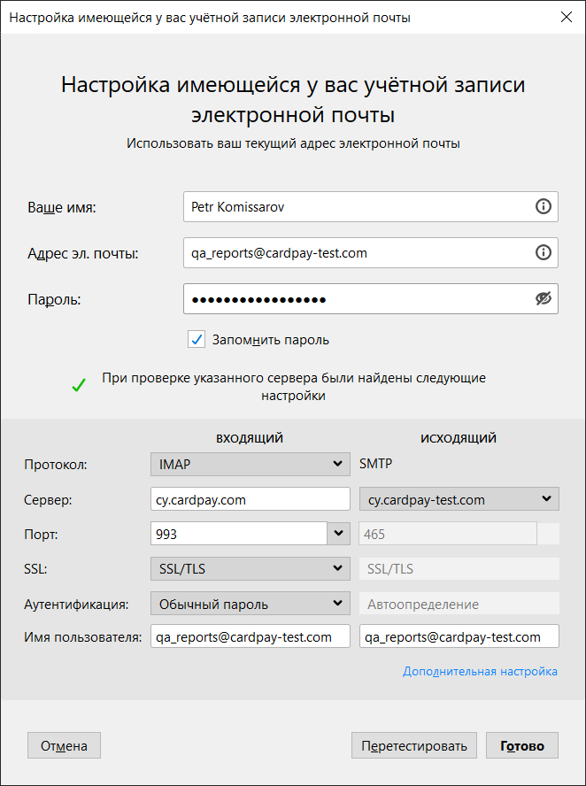

# DRD Reports Tests

## Email

## Run

<pre>
./gradlew test
</pre>
Or using Jenkins [pipeline](https://jenkins.cardpay-test.com/view/dashboard/job/drd-reports-tests/build?delay=0sec).

## Local report

Disable a VPN connection.

<pre>
./gradlew allureReport allureServe
</pre>

## Integrations

Please, see a [documentation](https://confluence.cardpay.com/display/TR/Help+tools).
